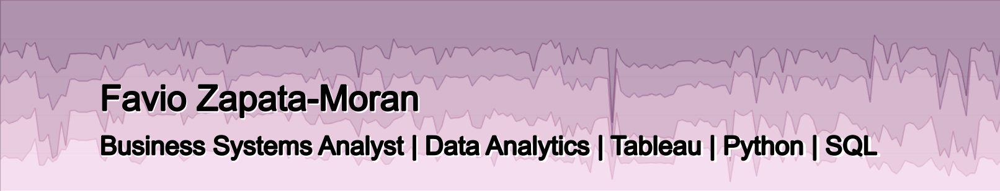

## Hello there! I'm Favio Zapata-Moran. 
#### A Business Systems Analyst at UCR Administrative Services Strategic Executive Team (ASSET)
I build Tableau Dashboards and data solutions across the ASSET portfolio, primarily supporting PB&A, Facilities Services, and Planning, Design, and Construction.

#### Tools: SQL, Python, Tableau, Smartsheet
### Portfolio Projects:

**1. [Highlight Project](https://github.com/Favio-Zapata/HVAC-Filter-Analysis):** Facilities Services Air Filter Vendor Bid Analysis
**2. [Customer Facing Project](https://github.com/Favio-Zapata/UCR-Planning-Design-and-Construction-Capital-Projects-Dashboard):** Planning, Design, and Construction Capital Projects Dashboard
**3. [ETL Project](https://github.com/Favio-Zapata/Recharge-Recon):** Planning, Budget, and Administration Payroll Recharge/Transfer Dashboard  

